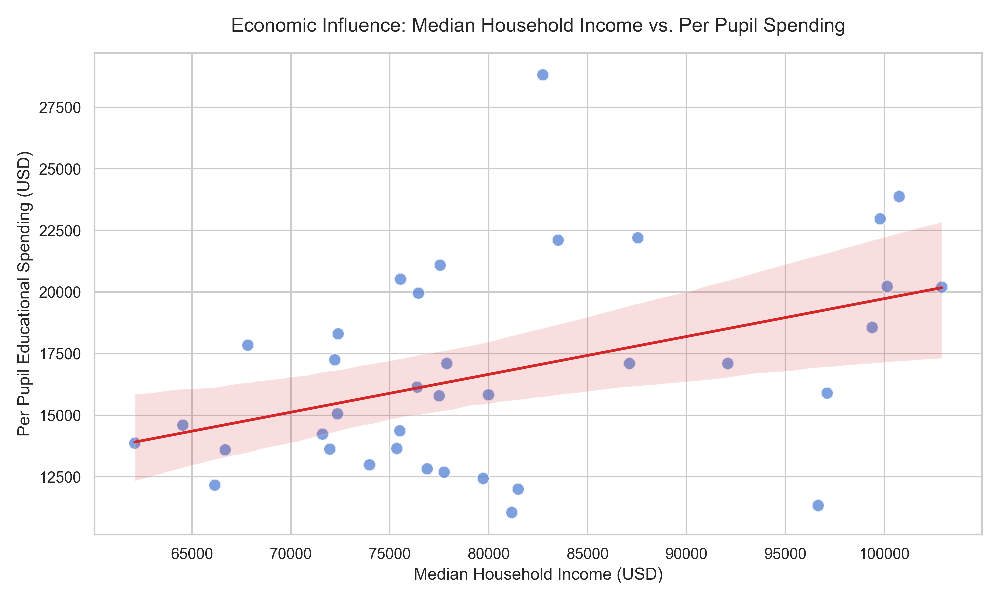
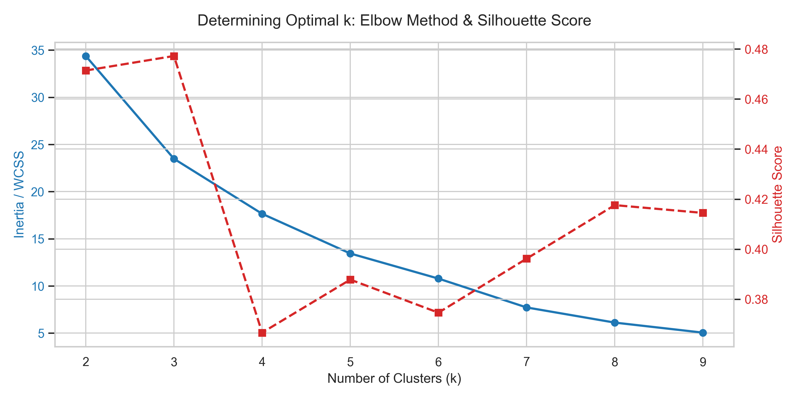
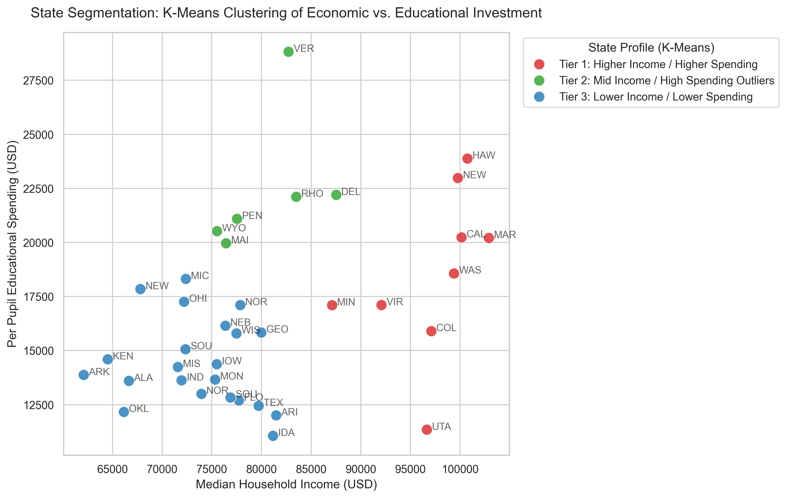

# Interstate Special Education Resource Allocation Analysis
**Course: IS477 Data Curation** | **Milestone 4: Full Pipeline & Analysis**

## Contributors
- **Beichen Hu** — Lead Data Engineer
- **Yizhou Fang** — Lead Data Steward

## Summary
This project investigates the relationship between state-level economic wealth (Median Household Income) and resources allocated to special education—specifically focusing on students with hearing impairments under the Individuals with Disabilities Education Act (IDEA).

IDEA mandates that all students with disabilities receive a Free Appropriate Public Education (FAPE). However, the actual funding mechanisms that support this mandate vary significantly across states. By integrating socioeconomic data from the U.S. Census Bureau with school finance records and IDEA disability student counts, we aim to quantify whether wealthier states systematically invest more per student—and whether this creates structural inequities for special education communities in lower-income states.

We curated and integrated three federal datasets: the 2024 American Community Survey (ACS) S1901 table providing state-level median household income, the 2024 Public Elementary-Secondary School System Finances (ELSEC) providing per-pupil spending figures, and the IDEA Section 618 Part B Child Count data documenting students with hearing impairments by state. Our data pipeline involved transforming the Census Bureau's complex wide-format data into a tidy long format, parsing irregularly formatted Excel tables using regular expressions, cleaning privacy-suppressed values in the IDEA data, and performing relational inner joins across all three sources using standardized state names.

Our analysis of 37 states with complete data reveals a statistically significant positive correlation between median household income and per-pupil education spending. K-Means clustering (k=3) segmented states into three distinct socioeconomic-educational tiers, revealing that high-income states spend on average thousands more per pupil than low-income states. The hearing impairment student counts also correlate strongly with total revenue, though this is largely driven by state population size.

## Data Profile

### Dataset 1: American Community Survey (ACS) 1-Year Estimates S1901 (2024)
- **Source:** U.S. Census Bureau
- **URL:** https://data.census.gov/table?q=S1901&g=010XX00US$0400000
- **File:** [`data/raw/ACSST1Y2024.S1901-2026-03-09T222516.csv`](data/raw/ACSST1Y2024.S1901-2026-03-09T222516.csv)
- **Structure:** CSV, wide format (17 rows × 417 columns). Each state has 8 columns (4 household categories × Estimate/Margin of Error).
- **Content:** 2024 estimated median household income for 52 areas (50 states + DC + Puerto Rico). Range: $62,106 (Arkansas) to $102,905 (Maryland).
- **Ethical/Legal:** Public domain (17 U.S.C. § 105). All values aggregated at the state level; no individual data.
- **Role:** Independent variable—classifies states by income level.

### Dataset 2: Public Elementary-Secondary School System Finances (ELSEC 2024)
- **Source:** U.S. Census Bureau / NCES
- **URL:** https://www.census.gov/data/tables/2024/econ/school-finances/secondary-education-finance.html
- **File:** [`data/raw/elsec24_sumtables.xlsx`](data/raw/elsec24_sumtables.xlsx)
- **Structure:** XLSX with 3 sheets. Table 1: 62 rows × 12 columns, legacy formatting with dot-leader state names.
- **Content:** FY 2024 state-level revenue, expenditures, and per-pupil spending. Covers **37 of 52** reporting areas. Missing: Alaska, Connecticut, DC, Illinois, Kansas, Louisiana, Massachusetts, Mississippi, Nevada, New Jersey, New York, Oregon, Tennessee, West Virginia, Puerto Rico.
- **Ethical/Legal:** Public domain. No individual-level data.
- **Role:** Primary dependent variable—per-pupil spending measures resource allocation.

### Dataset 3: IDEA Section 618 Part B Child Count (2024-25)
- **Source:** U.S. Department of Education, OSEP
- **URL:** https://data.ed.gov/dataset/docs/idea-section-618-state-part-b-child-count-and-educational-environments
- **File:** [`data/raw/idea_child_count_2024.csv`](data/raw/idea_child_count_2024.csv)
- **Structure:** CSV with 5 metadata header rows (skipped), then data table. Columns: `State Name`, `SEA Disability Category`, multiple age-group columns. Contains privacy suppression symbols (`x`, `S`, `-`).
- **Content:** State-level counts of students with disabilities by category and age group. We extracted "Hearing Impairment" to quantify hearing-impaired students per state. Suppressed cells converted to NaN.
- **Ethical/Legal:** Public domain. Small counts suppressed per FERPA. We preserved suppressions as NaN rather than imputing.
- **Role:** Provides student-level need data for Research Question 2.

## Data Quality
We assessed all three datasets for completeness, consistency, accuracy, and structural integrity.

**Completeness:** ACS income data is complete for all 52 areas. ELSEC covers only 37 states—a significant gap. IDEA data contains privacy-suppressed values (`S`, `x`, `-`) for small populations, converted to NaN, which may slightly underestimate some state totals.

**Consistency:** State names appeared in three different formats across datasets: embedded in column headers ("Alabama!!Households!!Estimate" in ACS), dot-leader padded ("Alabama…......" in ELSEC), and a plain "State Name" column (IDEA). Regex-based cleaning standardized all names, producing exact matches across sources.

**Accuracy:** Validated against benchmarks—Maryland highest income ($102,905), Arkansas lowest ($62,106); Vermont highest spending ($28,818), Idaho lowest ($11,056). All consistent with published NCES reports. No implausible outliers detected.

**Structural Integrity:** Inner join retains only states present in all three datasets. SHA-256 checksums computed during pipeline execution for file integrity verification.

## Data Cleaning
All cleaning was performed programmatically in Python for full reproducibility.

**Wide-to-Long Transformation (ACS):** Applied `pandas.melt()` to reshape from 417-column wide format to tidy long format. Filtered for "Median income (dollars)" rows and "Households!!Estimate" columns, reducing to a 52-row table.

**State Name Extraction:** Used regex `r'^([a-zA-Z\s]+)!!'` for ACS, `r'\.{3,}'` + `r'[^a-zA-Z\s]'` for ELSEC, and `str.strip()` for IDEA to standardize all state names for perfect join-key alignment.

**Numeric Coercion:** Stripped non-numeric characters from income values with `replace(r'[^\d.]', '', regex=True)`. ELSEC read with `header=None` to bypass irregular multi-row headers. All numeric columns coerced with `pd.to_numeric(errors='coerce')`.

**Privacy Suppression Handling (IDEA):** Replaced `x`, `S`, `-` symbols with `np.nan`. Hearing impairment counts aggregated per state using `sum()`, which excludes NaN by default—preserving data integrity without illegal imputation.

## Findings
Our analysis of 37 states with complete data reveals:

**Research Question 1—Income vs. Spending:** A statistically significant positive correlation exists between median household income and per-pupil spending. States with higher incomes tend to invest more per student, though income explains only part of the variance—state policies and cost of living also matter.

**K-Means Clustering (k=3):** Validated via Elbow Method and Silhouette Score, states cluster into three tiers:
- **Tier 1 (Higher Income / Higher Spending):** States like Maryland, Vermont, New Hampshire
- **Tier 2 (Mid Income / Moderate Spending):** Middle group
- **Tier 3 (Lower Income / Lower Spending):** States like Arkansas, Idaho, South Carolina

**Research Question 2—Hearing Impairment & Revenue:** Strong positive correlation between `HI_Student_Count` and `Total_Revenue_Thousands`, but largely driven by population size—larger states have both more students and more revenue.





## Future Work
- **Per-capita normalization:** Dividing HI student counts by total student population would control for state size and reveal true funding adequacy.
- **Fill ELSEC gaps:** Incorporate prior-year data or Census API to recover the 15 missing states (including NY, IL, MA).
- **Longitudinal analysis:** Tracking 2019–2024 trends would show whether disparities are widening and capture COVID-era effects.
- **Additional covariates:** State tax revenue, cost-of-living, and political variables could improve clustering beyond the current two-variable model.
- **Lessons learned:** Programmatic regex pipelines are essential for federal data; privacy-suppressed values must be treated as NaN, not imputed.

## Challenges
- **Federal Data Formatting:** ACS's 417-column wide format and ELSEC's dot-leader padded Excel layout both required regex-based cleaning rather than standard loading methods.
- **Privacy Suppression:** IDEA data suppresses cells <10 students with `S`/`x`/`-`. These cannot be imputed, slightly underestimating some state totals.
- **Spatial Coverage Gap:** ELSEC covers only 37/52 areas. Inner join further limits the analysis to states in all three datasets.
- **Temporal Alignment:** ACS (calendar year 2024), ELSEC (fiscal year 2024), and IDEA (school year 2024–25) have slight misalignment.

## Reproducing
### Prerequisites
- Python 3.9+
- pip

### Steps
```bash
# 1. Clone the repository
git clone https://github.com/Beichen-H/IS477_HF.git
cd IS477_HF

# 2. Install dependencies
pip install -r requirements.txt

# 3. Run the full pipeline
snakemake -c1
```

This executes two rules:
1. `clean_and_integrate` → `scripts/01_data_pipeline.py` → produces `data/processed/integrated_special_ed_data.csv`
2. `analyze_data` → `scripts/02_data_analysis.py` → produces visualizations and `data/processed/clustered_integrated_dataset.csv`

### Output Files
| File | Description |
| :--- | :--- |
| `data/processed/integrated_special_ed_data.csv` | Merged dataset (37 states × 5 columns) |
| `data/processed/clustered_integrated_dataset.csv` | Dataset with K-Means cluster labels |
| `data/processed/fig01_income_vs_spending.png` | Regression scatter plot |
| `data/processed/fig02_cluster_evaluation.png` | Elbow method + silhouette score |
| `data/processed/fig03_kmeans_clustering.png` | State clustering visualization |

## References

### Datasets
1. U.S. Census Bureau. (2024). *American Community Survey 1-Year Estimates, Table S1901*. https://data.census.gov/table?q=S1901&g=010XX00US$0400000
2. U.S. Census Bureau & NCES. (2024). *Annual Survey of School System Finances (ELSEC)*. https://www.census.gov/data/tables/2024/econ/school-finances/secondary-education-finance.html
3. U.S. Department of Education, OSEP. (2025). *IDEA Section 618 Part B Child Count, SY 2024-25*. https://data.ed.gov/dataset/docs/idea-section-618-state-part-b-child-count-and-educational-environments

### Software
4. McKinney, W. (2010). Data Structures for Statistical Computing in Python. *Proc. 9th Python in Science Conf.*, 56–61.
5. Harris, C. R., et al. (2020). Array programming with NumPy. *Nature*, 585, 357–362.
6. Hunter, J. D. (2007). Matplotlib: A 2D Graphics Environment. *Comput. Sci. Eng.*, 9(3), 90–95.
7. Waskom, M. (2021). seaborn: statistical data visualization. *JOSS*, 6(60), 3021.
8. Pedregosa, F., et al. (2011). Scikit-learn: Machine Learning in Python. *JMLR*, 12, 2825–2830.
9. Mölder, F., et al. (2021). Sustainable data analysis with Snakemake. *F1000Research*, 10, 33.

## Contributions

### Beichen Hu (Lead Data Engineer)
Beichen was responsible for the technical implementation of the project. He established the GitHub repository structure, authored the data pipeline script (`01_data_pipeline.py`) implementing regex-based parsing and cleaning for all three datasets, and developed the analysis script (`02_data_analysis.py`) with regression analysis and K-Means clustering. He configured the Snakemake workflow for end-to-end automation and managed all data acquisition, including finding an alternative source for the IDEA child count data when the original portal experienced server errors.

### Yizhou Fang (Lead Data Steward)
Yizhou was responsible for data quality assurance, metadata documentation, and project reporting. She reviewed and validated the structure of all three datasets, confirming their suitability for the research questions. She performed post-integration quality checks including verifying state name consistency across sources, validating that merged records were complete and free of duplicates, and confirming that privacy-suppressed values in the IDEA data were handled correctly. She authored the data dictionary, machine-readable metadata (Schema.org JSON-LD), and the documentation components of the final report including the Data Profile, Data Quality, and Challenges sections. She also ensured compliance with licensing requirements for all federal data sources.

## License
This project is licensed under the **MIT License**. See [LICENSE](LICENSE) for details.
All datasets are in the **public domain** as U.S. federal government works.
